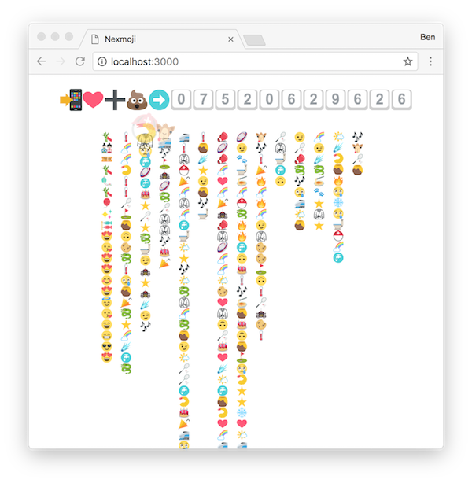

# Nexmoji

This is a demo app for showing some capabilities of the platform to a medium to large group of people.

The basic flow is:

1. Collect numbers from people in the room
2. Show some features of nexmo using those numbers

## Collecting numbers

This is done by displaying a number on a projector and asking people to text it with lots of emoji. As messages are received, the emoji are pulled out and displayed on screen.

## Showing demos

The next step is to load a demo, do this by opening a page **in the same browser tab** as the emoji collector.

* `/demo-01.html` - send out a text message to all numbers collected
* `/demo-02.html` - make an outgoing voice call to people _(todo: resolve auth issues)_

The idea is that new demos can be added to this tool. For example:

* choir demo - server-side pitch detect to get everyone to sing together
* voice recognition - redirect to another service and display words on screen
* record audio with gUM - send out as a recorded message
* etc

# Technical

All messages are stored locally in session storage, so you are able to refresh the page at any point. **Note**, closing the tab will lose the captured data.  This makes it cleaner for implementation (no need for a backend data store), and makes the ux more straightforward for events.

To authenticate a session, visit `/auth.html` and put in the password.

Emoji are rendered with [emojione](http://emojione.com/) which should make things more consistent.

## Requirements

* node/npm
* Redis (for persistent auth sessions)
* Nexmo account/number/app
